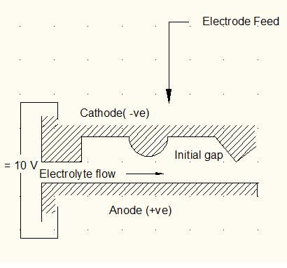

### Theory

**Working principle of Electrochemical machining**

Electrochemical machining is based on the electrolysis process as outlined in Fig. 1, the workpiece and tool are the anode and cathode respectively, of the electrolytic cell, and a potential difference, usually about 10 V, is applied across them. A suitable electrolyte, for example aqueous sodium chloride solution is chosen so that the cathode shape remains unchanged during electrolysis. The electrolyte is pumped at a rate 3 to 30 m/sec through the gap between electrodes to remove the products of machining and to diminish unwanted effects, such as those that arise with cathodic gas generation and electric heating. The rate at which metal is then removed from the anode is approximately in inverse proportion to the distance between the electrodes. As machining proceeds and with the simultaneous movement of the cathode at a typical tool feed rate, for example, 0.02 mm/sec towards the anode, the gap width along the electrode length will gradually tend to a steady-state value. Under these conditions, a shape, roughly complementary to that of cathode, will be produced on the anode. A typical gap width then should be about 0.4 mm.

**Development of characteristic equaweightstion of ECM:**

**1. Faraday's laws of electrolysis**
The results of electrolysis are embodied in Faraday's two laws of electrolysis as below
The amount of any substance dissolved or deposited is directly proportional to the amount of electricity which has flowed; and The amounts of different substances deposited or dissolved by the same quantity of electricity are proportional to their chemical equivalent weights.

The two laws may be combined to give the equation

m = AIt/zF        ....................(1)

Where m = the mass dissolved from or deposited upon\
       I = current\
       t = time  \      
	   A = Automic Weight\
       z = valency, A/z is the chemical equivalentemical equivalent\
       F = Faraday's constant, it is the amount of electric charge necessary to liberate one gram equivalent (A/z) of an ion in electrolysis and is equal to 96500 C.

**2. Ohm's law and related concepts**

The means by which high current densities are obtained can be understood from an examination of other characteristics of an ECM cell in particular, the electrolyte conductivity and inter-electrode gap width. These parameters are related to the current through Ohm's law, which states that the current I flowing in a conductor is directly proportional to the applied voltage V.

V= IR        ------(2)

R is the resistance of the conductor.
In electrolysis process, electrolytes are conductors of electricity. Ohm's law also applies to this type of conductor, although the resistance of electrolytes may amount to hundreds of ohms.
Now, the resistance R of a uniform conductor is directly proportional to its length h, and inversely proportional to its cross sectional area A. Thus

R=h&rho;/A       ...................(3)

Where &rho; is the constant of proportionality. If the conductor is a cube of side 10 mm, then R = &rho; ; &rho; is termed as specific resistivity of the conductor. The reciprocal of specific resistivity is known as specific conductivity. Combining equations 2 and 3 the relationship are derived between the average current density, current, surface area to be machined, applied potential difference, gap width, and electrolyte conductivity being denoted by the respective symbols J, I, A, V, h, and ke

j= I/A = Ke V/h        ...............(4)

In actual practice the voltage value ranges from 10 to 20 V. and for this the gap width is about 0.4 mm and tool feed rate about 0.02 mm/sec is needed.