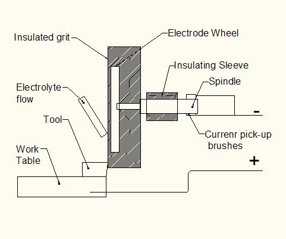

### Procedure
**Electrochemical grinding process**

Electrochemical grinding process (ECG) is derived from ECM (Electrochemical Machining) process that combines electrolytic activity with the physical removal of material by means of electrically charged grinding wheel. It is the process that removes electrically conductive material by grinding; with a negatively charged abrasive grinding wheel, and a positively charged work piece. Material removed from the workpiece is carried by the electrolyte fluid present. Electrochemical grinding and electrochemical machining are principally similar to each other; however a grinding wheel is used instead of a tool which is replica of the contour to be obtained on the work piece.

process: The wheels are metal disks embedded with abrasive particles. Copper, brass and nickel are the most commonly used materials; aluminum oxide is typically used as an abrasive when grinding steel. A thin layer of diamond particles will be used when grinding carbides or steels harder then Rockwell C 65.

The process set up for the electrochemical grinding is as shown in fig. 2. An electrolytic spindle with carbon brushes, acting as a commutator, holds the wheel. The spindle receives a negative charge from the DC power supply, which gives the work piece a positive charge. The electrolytic fluid is applied where the work contacts the tool by a nozzle similar to that, which supplies coolant in conventional grinding. The fluid works with the wheel to form electrochemical cells that oxidizes the surface of the work piece. As the wheel carries away the oxide, fresh metal is exposed. Removing oxidized fluid may only require a pressure of 20 psi or less, causing much less distortion than mechanical grinding. The wheel is subjected to little wear, reducing the need for truing and dressing.

**Process parameters governing MRR**

The mechanical metal removal mechanism is mechanically affected by following process parameters -
1. Type of abrasive, grain size, grain concentration, profile of the grinding wheel and bonding material used.
2. Shape of work material, pretreatment process involved and surface topography and
3. Machining conditions such as feed rate, wheel speed, depth of cut etc.
The aim of adopting electrochemical grinding (ECG) process is to attain higher material removal rate than conventional grinding. Also the important parameters such as dimensional control and surface integrity are better addressed by ECG. The significant parameters are listed below.

1. Input voltage across the two electrodes
2. Equivalence of atomic weight and valency of elements of work material
3. Conductivity and strength of electrolyte
4. Gap width
5. Degree of polarization or passivationprinciple
6. Presence of gas in the machining gap
7. Process durability.